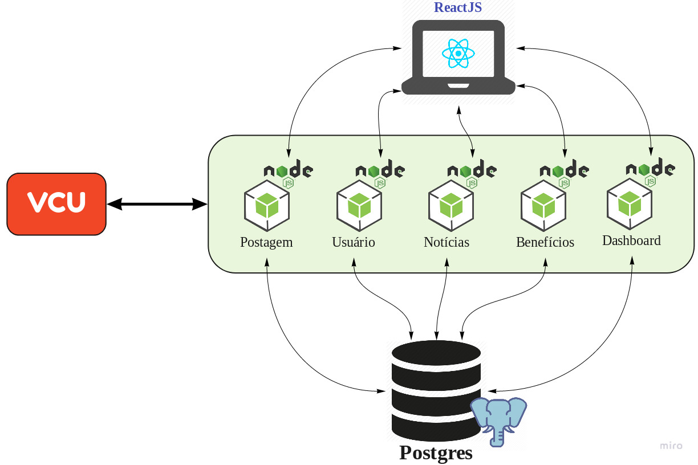
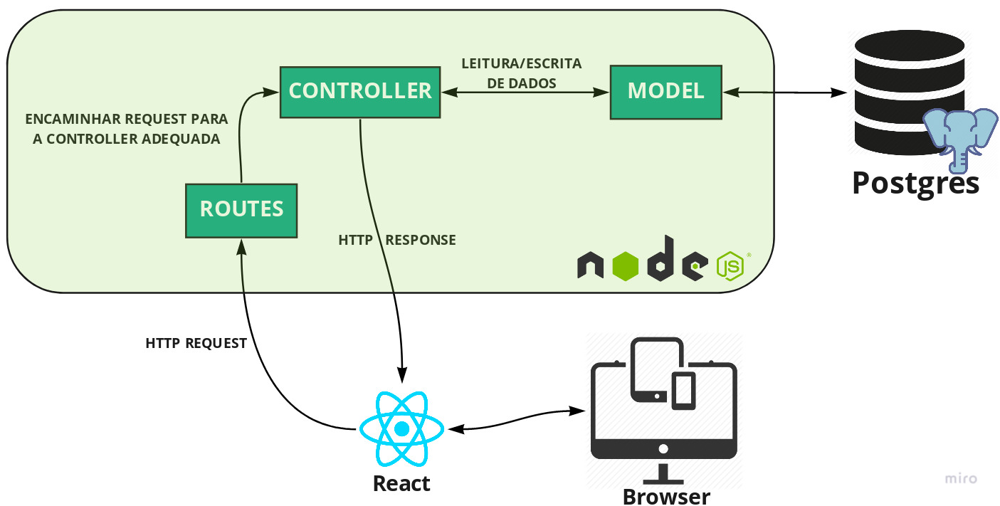
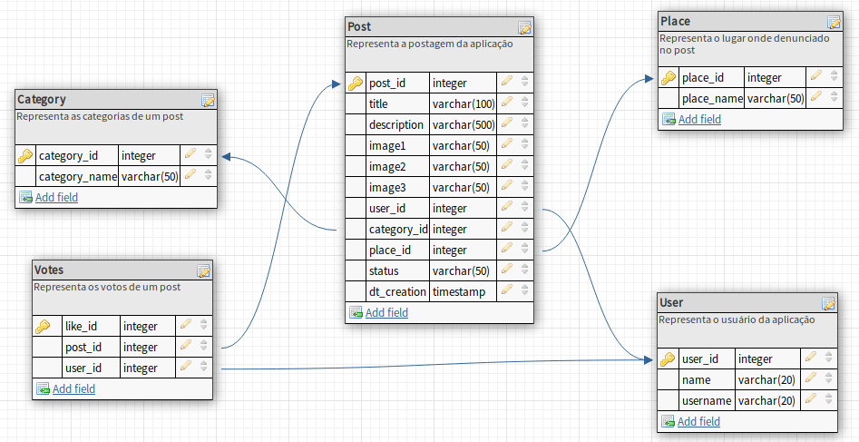
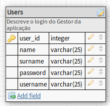
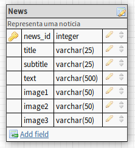
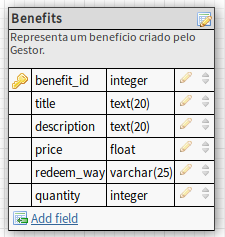
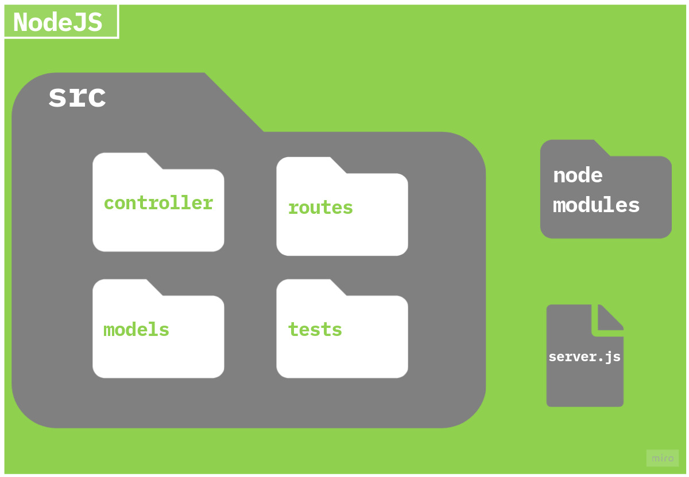
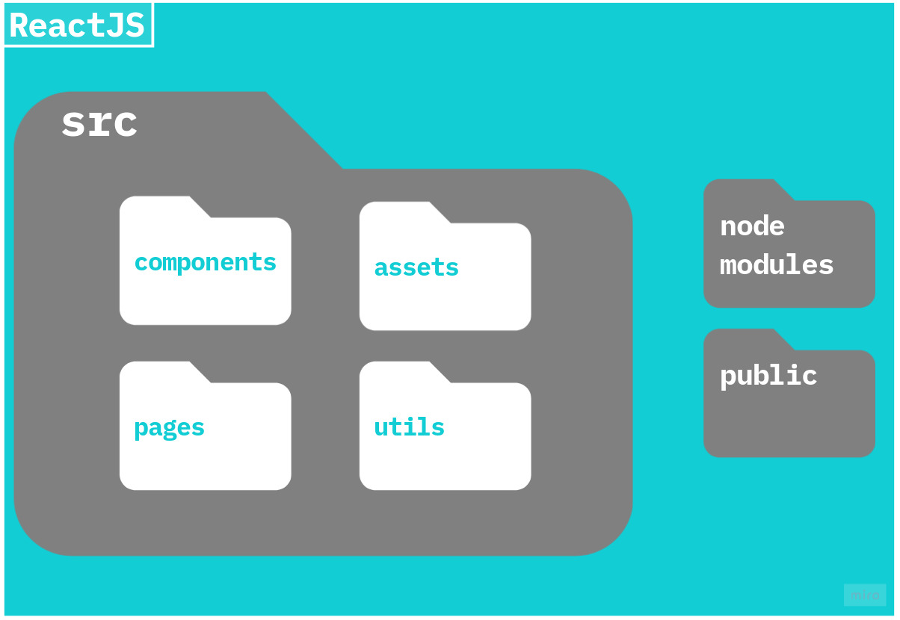

# Documento de Arquitetura de Software

## Histórico de Revisão

| Data | Versão | Descrição | Autor(es) |
|:--------:|:--------:|:----------------------:|:------------------:|
| 14/09/2020 | 0.1 | Criação do Documento e Adição do template e do sumário | Guilherme Aguiar |
| 18/09/2020 | 0.2 | Criação da visão de casos de uso | Bruno Nunes |
| 21/09/2020 | 0.3 | Criação das Metas e Restrições Arquiteturais | Tomás Veloso |

## Sumário

[1. Introdução](#1-introducao)  
[1.1 Objetivo](#11-objetivo)  
[1.2 Escopo](#12-escopo)  
[1.3 Definições, Acrônimos e Abreviações](#13-definicoes-acronimos-e-abreviacoes)  
[1.4 Referências](#14-referencias)  
[1.5 Visão Geral](#15-visao-geral)  
[2. Representação Arquitetural](#2-representacao-arquitetural)  
[2.1 Plataforma ReactJS](#21-plataforma-reactjs)  
[2.2 API](#22-api)  
[2.2.1 User](#221-user)  
[2.2.2 Resolution](#222-resolution)  
[2.2.3 Reports](#223-reports)  
[2.2.4 News](#224-news)  
[2.2.5 Benefits](#225-benefits)   
[2.2.6 Adverts](#226-adverts)  
[2.3 Banco de Dados](#23-banco-de-dados)  
[3. Restrições e Metas Arquiteturais](#3-restricoes-e-metas-arquiteturais)  
[4. Visão de Casos de Uso](#4-visao-de-casos-de-uso)  
[4.1 Atores](#41-atores)  
[4.2 Diagrama UC](#42-diagrama-uc)  
[4.3 Descrição dos Casos de Uso](#43-descricao-dos-casos-de-uso)  
[5. Visão Lógica](#5-visao-logica)  

## 1. Introdução

### 1.1 Objetivo

Este documento tem como finalidade fornecer uma visão arquitetural abrangente do sistema Vamos Cuidar Gestão, por meio de diversas visões arquiteturais para representar diferentes aspectos da aplicação. Com o propósito de demonstrar as decisões arquiteturais tomadas no desenvolvimento do Vamos Cuidar Gestão.

### 1.2 Escopo

### 1.3 Definições, Acrônimos e Abreviações

As Definições, Acrônimos e Abreviações para entendimento do documento são:

* UnB: Universidade de Brasília
* FGA: Faculdade do Gama - Campus da Universidade de Brasília
* API: Application Programming Interface (Interface de Programação de Aplicativos)
* REST: Representational State Transfer (Transferência de Estado Representacional)
* HTTP: Hypertext Transfer Protocol (Protocolo de Transferência de Hipertexto)
* IDE: Integrated Development Environment (Ambiente de Desenvolvimento Integrado)
* App: Application (Aplicativo)
* MVC: Model-View-Controller
* UC: Use Case (Caso de Uso)
* VCU: Vamos Cuidar Usuário: Plataforma desenvolvida pelo grupo de MDS da professora Carla, com a qual nossa aplicação irá se comunicar.
* VCG: Vamos Cuidar Gestão: A nossa plataforma

### 1.4 Referências

As referências aplicáveis são:

* [https://sce.uhcl.edu/helm/RationalUnifiedProcess/webtmpl/templates/a_and_d/rup_sad.htm#1.%20%20%20%20%20%20%20%20%20%20%20%20%20%20%20%20%20%20Introduction](https://sce.uhcl.edu/helm/RationalUnifiedProcess/webtmpl/templates/a_and_d/rup_sad.htm#1.%20%20%20%20%20%20%20%20%20%20%20%20%20%20%20%20%20%20Introduction)

* [https://ads-unigrade-2019-1.github.io/Wiki/dinamica06/DAS/](https://ads-unigrade-2019-1.github.io/Wiki/dinamica06/DAS/)

### 1.5 Visão Geral

Este documento visa detalhar as soluções arquiteturais desenvolvidas no sistema. Deste modo, neste documento serão abordados os seguintes aspectos:

* Representação Arquitetural
* Restrições e Metas Arquiteturais
* Visão de Casos de Uso
* Visão Lógica

## 2. Representação Arquitetural

O sistema é composto de três frentes:

* 
A frente da aplicação, será feita com em Javascript com a biblioteca **ReactJS**, que oferece ao usuário gestor as opções de interação com a plataforma feita da outra turma de MDS (VCU), tais como resolver uma postagem, relatórios sobre a plataforma e a criação de notícias e benefícios.

* 
 A frente das API's, também utilizaremos Javascript, mas no server usaremos o **NodeJS**. Baseando-se na arquitetura de microserviços, é composta por 5 serviços (pacotes), cada um com suas próprias responsabilidades e deveres. 

* 
 A frente de dados, onde teremos um banco de dados **PostgreSQL**, hospedado na infraestrutura da Unb, onde serão persistidos os dados que iremos receber do VCU e onde iremos salvar os artefatos criados na nossa plataforma. Já no ambiente de desenvolvimento, usaremos o postgres localmente com o Docker

Cada frente possui sua própria arquitetura interna.

### 2.1 Plataforma ReactJS

 Em poucas palavras, o React é uma biblioteca JavaScript para criação de interfaces para o usuário, desenvolvida e mantida pelo Facebook, sua primeira release saiu em 2013. É  uma lib open-source com mais de 1k de colaboradores ativos no GitHub.

Ela está presente no nosso dia-a-dia mais do que você imagina, em empresas grandes como Facebook, Instagram, AirBnB, NFL, Yahoo e muito mais. O mercado para essa biblioteca só cresce.

### 2.2 API

Os microserviços da aplicação vão seguir o mesmo padrão, será usado o Nodejs para a lógica no back-end, seguindo a o padrão arquitetural MVC, onde a camada da View fica como o ReactJS. O padrão de organização dos elementos arquiteturais está representado no diagrama acima. 

### 2.3 Banco de dados

PostgreSQL é um sistema de banco de dados relacional de objeto de código aberto com mais de 30 anos de desenvolvimento ativo que lhe rendeu uma forte reputação de confiabilidade, robustez de recursos e desempenho. O banco é divido em schemas, cada microserviço irá interagir com um único esquema, o que contribui para a independência dos microserviços e a diminuição do acoplamento. A seguir serão representadas o diagrama dos esquemas.

#### 2.3.1  Postagem

#### 2.3.1  Usuário

#### 2.3.1  Notícias

#### 2.3.1  Benefícios

## 3. Restrições e Metas Arquiteturais

A tomada de decisão pela arquitetura de pequena escala (software), foi tomada a partir da Engenharia de Requisitos conciliado com o levantamento de restrições para o desenvolvimento do software e o usuário de destino. Entretanto, existem restrições no funcionamento do software, restrições de design, operacionais e de compatibilidade. Sendo assim, para melhor atender os requisitos definidos e utilizar das melhores tecnologias disponíveis, foram selecionadas as metas e restrições de arquitetura.

### 3.1 Usabilidade

Aplicação Web (site), com interface de um dashboad de fácil entendimento de suas informações e dados visuais intuitivos. Responsivo para se adequar as diferentes formas de acessá-lo.

### 3.2 Manutenibilidade

Um software com alta capacidade de ser modificado para adequar-se a novos requisitos solicitado.

### 3.3 Escalabilidade

Capaz de suportar o crescimento no número de usuários que utilizarem a plataforma.

### 3.4 Portabilidade

Poderá ter acesso à aplicação web, com acesso a internet, por qualquer navegador web.

### 3.5 Segurança

O acesso à aplicação será seguro ao usuário, sendo uma ferramenta confiável para o acesso.

### 3.6 Restrições de design

As restrições de design estão relacionadas às ferramentas e tecnologias escolhidas para para o desenvolvimento de software. A elaboração do projeto será realizada utilizando JavaScript, ReactJS, HTML, CSS, Kibana, Logstash, Docker e PostgreSQL.

### 3.7 Restrições operacionais

Para as restrições operacionais referentes à aplicação, está o fato que a tecnologia desenvolvida para sua operação necessita da interação com um servidor disponibilizado por terceiros.

### 3.8 Restrições compatibilidade

A tecnologia será desenvolvida em parceria com outro desenvolvimento de software, portanto, o software devem está de acordo com outro projeto para que a interação entre as tecnologias funcionem corretamente, sem problemas de compatibilidade entre elas.

## 4. Visão de Casos de Uso

### 4.1 Atores

| Atores | Descrição |
|:--------:|:--------:|
| Gestor | O administrador da plataforma que gerencia a aplicação Vamos Cuidar  |
| NodeJS API  | A interface de programação de aplicações que irá se comunicar com outra plataforma  |

## 4.2 Diagramas UC

### 4.3 Descrição dos Casos de Uso

| Caso de uso | Descrição do caso de uso |
|:--------|:--------:|
| UC01 - Visualizar dashboard | Este caso de uso ocorrerá quando o gestor acessar a página principal ou seção Dashboard  |
| UC02 - Listar situação do problema | Este caso de uso poderá ocorrer quando o gestor entrar na seção de situações e receber as informações |
| UC03 - Visualizar situação do problema | Este caso de uso ocorrerá quando o NodeJS API solicitar as situações |
| UC04 - Atualizar situação do problema | Este caso de uso ocorrerá quando o gestor acessar uma situação |
| UC05 - Carregar informações | Este caso de uso ocorrerá quando o NodeJS API submeter uma situação |
| UC06 - Criar anúncios | Este caso de uso ocorrerá quando o gestor clicar na criação de anúncio e inserir dados sobre o anúncio |
| UC07 - Editar anúncios | Este caso de uso ocorrerá quando o gestor já tiver criado previamente um anúncio |
| UC08 - Deletar anúncios | Este caso de uso ocorrerá quando o gestor já tiver criado previamente um anúncio |
| UC09 - Listar anúncios | Este caso de uso ocorrerá quando o gestor entrar no seção de anúncios |
| UC10 - Visualizar anúncios | Este caso de uso ocorrerá quando o NodeJS API requisitar os anúncios |
| UC11 - Criar notícia | Este caso de uso ocorrerá quando o gestor clicar na criação de notícias e inserir dados sobre o mesmo |
| UC12 - Editar notícia | Este caso de uso ocorrerá quando o gestor já tiver criado previamente uma notícia |
| UC13 - Deletar notícia | Este caso de uso ocorrerá quando o gestor já tiver criado previamente uma notícia |
| UC14 - Listar notícias | Este caso de uso poderá ocorrer quando o gestor entrar no seção de notícia |
| UC15 - Visualizar notícia | Este caso de uso ocorrerá quando o NodeJS API requisitar as notícias |
| UC16 - Criar benefício | Este caso de uso ocorrerá quando o gestor clicar na criação de um benefício e inserir dados sobre o mesmo |
| UC17 - Editar benefício | Este caso de uso ocorrerá quando o gestor já tiver criado previamente um benefício |
| UC18 - Deletar benefício | Este caso de uso ocorrerá quando o gestor já tiver criado previamente um benefício |
| UC19 - Listar benefícios | Este caso de uso ocorrerá quando o gestor entrar no seção de benefícios |
| UC20 - Visualizar benefício | Este caso de uso ocorrerá quando o NodeJS API requisitar os benefícios |

## 5. Visão Lógica

### 5.1 NodeJS

#### 5.1.1 Visão Geral

Para o back end, cada microserviço tem sua visão geral composta de quatro pacotes:

* Controller  
Possui classes que são responsáveis pela execução de código que prepara os dados para sua exibição no React, também são responsáveis por controlar as chamadas à API e despachar o resultado para o local adequado, seja o React que esteja aguardando ou outros objetivos.
* Models  
Classes que fazem representação dos dados que o aplicativo deve persistir localmente, como os dados das postagens a aplicação deve listar. Essas classes também contém algumas operações específicas aos seus objetos.
* Routes  
A camada de roteamento define a maneira como as solicitações do cliente são tratadas pelos endpoints do aplicativo.
* Test  
Pacote da aplicação onde são realizados os testes unitários da lógica da aplicação (controllers) e da estrutura da model.

#### 5.1.2 Diagrama de Pacotes

#### 5.1.2 Diagrama de Classes

### 5.2 ReactJS

#### 5.2.1 Visão Geral

Para o front end, cada microserviço tem sua visão geral composta de quatro pacotes:

* Public  
É onde residem seus arquivos estáticos. Se o arquivo não for importado por seu aplicativo JavaScript e precisar manter seu nome de arquivo, coloque-o aqui.
* Assets  
Na pasta assets ficam as dependências compartilhadas por seu aplicativo - como mixins SASS, imagens, etc. - podem ir para o diretório.
* Components  
A pasta onde ficam os componentes únicos do react. 
* Pages  
A pasta pages possuem componentes constituidos por vários componentes, que forman as páginas finais que são exibidas.
* Utils  
Esta é uma pasta cheia de funções auxiliares que são usadas globalmente. Mantenha seu código DRY (Don Don't Repeat Yourself) exportando a lógica repetida para um único local e importando-o onde for usado.

#### 5.2.2 Diagrama de Pacotes

