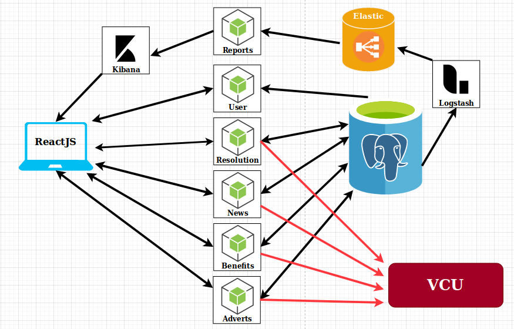

# Documento de Arquitetura de Software

## Histórico de Revisão

| Data | Versão | Descrição | Autor(es) |
|:--------:|:--------:|:----------------------:|:------------------:|
| 14/09/2020 | 0.1 | Criação do Documento e Adição do template e do sumário | Guilherme Aguiar |

## Sumário

[1. Introdução](#1-introducao)  
[1.1 Objetivo](#11-objetivo)  
[1.2 Escopo](#12-escopo)  
[1.3 Definições, Acrônimos e Abreviações](#13-definicoes-acronimos-e-abreviacoes)  
[1.4 Referências](#14-referencias)  
[1.5 Visão Geral](#15-visao-geral)  
[2. Representação Arquitetural](#2-representacao-arquitetural)  
[2.1 Plataforma ReactJS](#21-plataforma-reactjs)  
[2.2 API](#22-api)  
[2.2.1 User](#221-user)  
[2.2.2 Resolution](#222-resolution)  
[2.2.3 Reports](#223-reports)  
[2.2.4 News](#224-news)  
[2.2.5 Benefits](#225-benefits)   
[2.2.6 Adverts](#226-adverts)  
[2.3 Banco de Dados](#23-banco-de-dados)  
[3. Restrições e Metas Arquiteturais](#3-restricoes-e-metas-arquiteturais)  
[4. Visão de Casos de Uso](#4-visao-de-casos-de-uso)  
[4.1 Atores](#41-atores)  
[4.2 Diagrama UC](#42-diagrama-uc)  
[4.3 Descrição dos Casos de Uso](#43-descricao-dos-casos-de-uso)  
[5. Visão Lógica](#5-visao-logica)  
[6. Visão de Implementação](#6-visao-de-implementacao)  
[6.1 Modelagem de dados](#6.1-modelagem-de-dados)  
[6.2 Diagramas de Pacotes](#6.2-diagramas-de-pacotes)  

## 1. Introdução

### 1.1 Objetivo

Este documento tem como finalidade fornecer uma visão arquitetural abrangente do sistema Vamos Cuidar Gestão, por meio de diversas visões arquiteturais para representar diferentes aspectos da aplicação. Com o propósito de demonstrar as decisões arquiteturais tomadas no desenvolvimento do Vamos Cuidar Gestão.

### 1.2 Escopo

### 1.3 Definições, Acrônimos e Abreviações

As Definições, Acrônimos e Abreviações para entendimento do documento são:

* UnB: Universidade de Brasília
* FGA: Faculdade do Gama - Campus da Universidade de Brasília
* API: Application Programming Interface (Interface de Programação de Aplicativos)
* REST: Representational State Transfer (Transferência de Estado Representacional)
* HTTP: Hypertext Transfer Protocol (Protocolo de Transferência de Hipertexto)
* IDE: Integrated Development Environment (Ambiente de Desenvolvimento Integrado)
* App: Application (Aplicativo)
* MVC: Model-View-Controller
* UC: Use Case (Caso de Uso)
* VCU: Vamos Cuidar Usuário: Plataforma desenvolvida pelo grupo de MDS da professora Carla, com a qual nossa aplicação irá se comunicar.
* VCG: Vamos Cuidar Gestão: A nossa plataforma

### 1.4 Referências

As referências aplicáveis são:

* x

### 1.5 Visão Geral

Este documento visa detalhar as soluções arquiteturais desenvolvidas no sistema. Deste modo, neste documento serão abordados os seguintes aspectos:

* Representação Arquitetural
* Restrições e Metas Arquiteturais
* Visão de Casos de Uso
* Visão Lógica

## 2. Representação Arquitetural

O sistema é composto de três frentes:

* 
A frente da aplicação, será feita com em Javascript com a biblioteca **ReactJS**, que oferece ao usuário gestor as opções de interação com a plataforma feita da outra turma de MDS (VCU), tais como resolver uma postagem, relatórios sobre a plataforma e a criação de notícias, benefícios e anúncios. Para os relatórios iremos utilizar o **Kibana** para a criação de visualizações, inserindo essas visualizações no React por meio de Iframes.

* 
 A frente das API's, também utilizaremos Javascript, mas no server usaremos o **NodeJS**. Baseando-se na arquitetura de microserviços, é composta por 6 serviços (pacotes), cada um com suas próprias responsabilidades e deveres. 

* 
 A frente de dados, onde teremos um banco de dados **PostgreSQL**, hospedado no **Heroku**, onde serão persistidos os dados que iremos receber do VCU e onde iremos salvar os artefatos criados na nossa plataforma. Também contara com um banco de dados orientado a documentos chamado **elastic search**, onde os dados do postgres serão transformados por meio do plugin **logstash** para buscas de dados mais rápidas.

Cada frente possui sua própria arquitetura interna.

### 2.1 Plataforma ReactJS

x

### 2.2 API
x
#### 2.2.1 User
#### 2.2.2 Resolution
#### 2.2.3 Reports
#### 2.2.4 News
#### 2.2.5 Benefits
#### 2.2.6 Adverts

### 2.3 Banco de dados

## 3. Restrições e Metas Arquiteturais

Requisitos e restrições do sistema que influenciam na arquitetura:

* x
* y

## 4. Visão de Casos de Uso

### 4.1 Atores

| Atores | Descrição |
|:--------:|:--------:|
| xxxxxxxxxxxxxxxx | xxxxxxxxxxxxxxxxxxx  |

## 4.2 Diagramas UC

### 4.3 Descrição dos Casos de Uso

| Caso de uso | Descrição do caso de uso |
|:--------:|:--------:|
| xxxxxxxxxxxxxxx | xxxxxxxxxxxx  |

## 5. Visão Lógica

## 6. Visão de Implementação

### 6.1 Modelagem de dados

### 6.2 Diagramas de Pacotes

