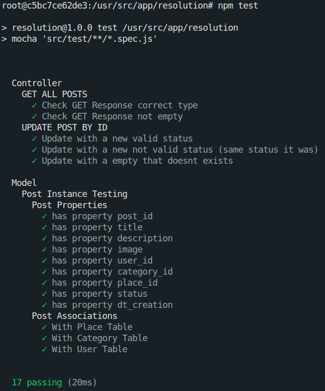
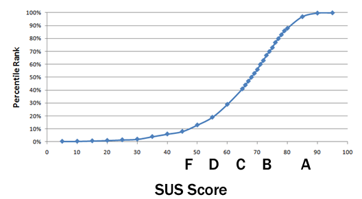

#	Documento de Qualidade

## Histórico de Revisão

|   Data   |  Versão  |        Descrição       |          Autor(es)          |
|:--------:|:--------:|:----------------------:|:---------------------------:|
|03/10/2020|   0.1    | Criação do Documento        |   Guilherme  |
|14/12/2020|   1.0    | Refatoração do Plano de Qualidade       |   Mateus Augusto  |

## Sumário
[1. Objetivo](#1-Objetivo)  
[2. Planejamento](#2-planejamento)  
[3. Testes Unitários](#3-testes-unitarios)  
[4. Testes Estáticos](#4-testes-estaticos) 
[5. Testes de Usabilidade](#5-testes-de-usabilidade)  

###	1. Objetivo

 Este documento objetiva explicitar os critérios, ferramentas e o planejamento da qualidade de código do projeto, esclarecendo o como, quais e porquês das adoções de cada tipo de teste durante o desenvolvimento do produto.

###	2. Planejamento

 Visando uma boa qualidade de código do projeto, alguns padrões de qualidade de corpos de conhecimentos e de normas foram definidos, tanto quanto as ferramentas que serão utilizadas para monitorar essa qualidade. Neste contexto, a qualidade será afirmada atravéz da aplicação de testes unitários, testes estáticos e testes de usabilidade.

### 3. Testes Unitários

 

 
 A aplicação de testes unitários se dá por meio da implementação de testes da menor parte testável de um programa Para o NodeJS escolhemos o Mocha, que é uma framework que permite rodar testes no nodejs de forma simples. Junto com o Mocha usamos o Chai, que por sua vez é uma biblioteca de asserção que pode ser emparalhada com qualquer framework de testes. Os testes são feitos tanto do escopo das models, como no escopo dos controllers de cada microserviço.

####  
Testes do serviço de postagem

 

### 4. Testes Estáticos
 
A análise estática de softwares, também conhecida como whitebox, trabalha diretamente com o código. Nesse caso, os componentes são verificados sem que o produto seja executado. No **Vamos Cuidar: Gestor** **foram** usadas ferramentas automatizadas no qual o principal objetivo dessa técnica é identificar erros de programação como práticas ruins, erros de sintaxe, identação entre outros. As ferramentas utilizadas são o  Codacy e o CodeClimate.

### 4.1 Codacy

 
O Codacy permite que as organizações assumam o controle de sua qualidade de código, incorporando cobertura de teste totalmente configurável e dados de manutenção em todo o fluxo de trabalho de desenvolvimento.

É partir do Codacy que são afirmados e monitorados os padrões de folha de estilo do projeto. Para o código em Javascript utilizamos os padrões do linter ESLint 7.10.0 tanto no frontend (ReactJS), como no backend (NodeJS). No frontend também utilizamos o CSSLint 1.0.5 para arquivos css. 

### 4.2 Code Climate

 
O Code Climate ajuda sua equipe a fazer um código melhor e mais rápido, incorporando análise estática totalmente configurável e dados de cobertura de teste em seu fluxo de trabalho de desenvolvimento.

 
O code climate é oferece á equipe, no escopo de frontend e backend, o poder de identificar métricas de manutenabilidade, duplicação de código, complexidade clicomática entre outras.  

### 5. Testes de Usabilidade

### 5.1 Introdução

 
O cumprimento de testes de usabilidade baseia-se na aplicação da técnica de validação utilizada para avaliar um produto ou serviço. Os testes são realizados com usuários representativos do público-alvo. No caso da plataforma **Vamos Cuidar: Gestor**, os testes são feitos com o funcionário do DAF da UnB.

 ### 5.2 Validação do Sistema e Teste de Qualidade em Uso

 
A validação com o cliente foi feita mediante a um teste em uso do sistema por parte de um dos gestores do DAF. Na sequência é descrito o planejamento e o relatório da execução e dos resultados do teste.

 #### Planejamento

 
O objetivo desse teste foi apresentar um versão do sistema contendo todos os requisitos elicitados ao longo do projeto e assim validar se as funcionalidades implementadas estavam de acordo com o esperado. Também foi objetivo verificar o nível de qualiadde em uso do sistema em relação a Eficácia, Eficiência e Satisfação do usuário.

 
O teste foi realizado remotamente, no qual foram passadas tarefas ao participante para serem executadas durante a chamada de vídeo. O participante recebeu o link de acesso ao sistema e compartilhou a tela de seu navegador durante o teste. As tarefas planejadas foram: 

- Tarefa 1 - Fazer Login
  - Descrição: Acessar o sistema inserindo o nome do usuário e a senha
  - Etapas:
    
    1 - Insira o Nome do usuário “username enviado pelo avaliador do teste”

    2 - Insira a Senha “senha enviada pelo avaliador do teste” 

    3 - Clique no botão “Entrar”

- Tarefa 2 - Listar Postagens 
  - Descrição: Acessar a lista de postagens e filtrá-las
  - Etapas:
    
    1 - clique na opção de listar postagens
    
    2 - escolha 1 ou mais filtros

    3 - Mude a página da lista de postagens

- Tarefa 3 - Alterar Status das Postagens
  - Descrição: Acessar detalhe das postagens e alterar o status
  - Etapas:

    1 - clique na opção de “postagens”

    2 - clique em uma postagem

    4 - clique na opção de ” alterar status para”

    4 - escolha um status

    5 - clique na opção “salvar”

- Tarefa 4 - Acessar Relatório de Dados 
  - Descrição: Acessar o relatório de dados
  - Etapas:

    1 - clique na opção de ”Relatório de Dados” 

    2 - alterne entre as opções de visualização do gráfico (hoje, semanal, Mensal e Anual) 

    3 - Acesse uma postagem pelo Ranking

- Tarefa 5 - Acessar Relatório de Status 
  - Descrição: Acessar o relatório de status
  - Etapas:

    1 - clique na opção de ”Relatório de Status” 

    2 - alterne entre as opções de visualização dos gráficos (hoje, semanal, Mensal e Anual)
    
    3 - Acesse uma postagem pelo Ranking

- Tarefa 6 - Criar uma notícia 
  - Descrição: Criar uma notícia
  - Etapas:
    
    1 - clique na opção de ”Criar Notícia” 
    
    2 - preencher campos corretamente
    
    3 - clicar na opção de “Enviar”

- Tarefa 7 - Editar uma notícia 
  - Descrição: editar uma notícia
  - Etapas:
    
    1 - clique na opção de ”Gerenciamento de Notícias” 
    
    2 - selecione a opção de editar a notícia
    
    3 - alterar alguns campos
    
    4 - clicar na opção de “Enviar”

- Tarefa 8 - Excluir uma notícia 
  - Descrição: excluir uma notícia
  - Etapas:
    
    1 - clique na opção de ”Gerenciamento de Notícias”
    
    2 - Selecione a opção de excluir uma notícia 
    
    3 - clicar na opção de “Excluir”

- Tarefa 9 - Criar um benefício
  - Descrição: Criar um benefício
  - Etapas:

    1 - clique na opção de ”Criar beneficio” 

    2 - preencher campos corretamente

    3 - clicar na opção de “Enviar”

- Tarefa 10 - Editar um benefício
  - Descrição: editar um benefício
  - Etapas:

    1 - clique na opção de ”Gerenciamento de Notícias” 

    2 - selecione a opção de editar benefício

    3 - alterar alguns campos

    4 - clicar na opção de “Enviar”

- Tarefa 11 - Excluir um benefício 
  - Descrição: excluir um benefício
  - Etapas:
    
    1 - clique na opção de ”Gerenciamento de Notícias”
    
    2 - Selecione a opção de excluir um benefício 
    
    3 - clicar na opção de “Excluir”

A cada tarefa o participante dava um feedback ao finalizá-la e após concluídas todas as tarefas ele iria dar um feedback geral. Por fim um formulário seguindo os itens do SUS (System Usability Scale) foi enviado ao participante para que ele respondesse. O resultado desse formulário traz um indicativo de qualidade de uso do sistema VCG. 

O SUS (System Usability Scale) é um método pra avaliar produtos, serviços. hardware, software, websites, aplicações entre outras interfaces.

O questionário é composto por 10 afirmações, no qual o usuário pode responder numa escala de 1 a 5, sendo 1, "Discordo Completamente" e 5, "Concordo Completamente". Segue os itens do questionário:

1. Eu acho que gostaria de usar esse sistema com frequência.
2. Eu acho o sistema desnecessariamente complexo.
3. Eu achei o sistema fácil de usar.
4. Eu acho que precisaria de ajuda de uma pessoa com conhecimentos técnicos para 5. usar o sistema.
5. Eu acho que as várias funções do sistema estão muito bem integradas.
6. Eu acho que o sistema apresenta muita inconsistência.
7. Eu imagino que as pessoas aprenderão como usar esse sistema rapidamente.
8. Eu achei o sistema atrapalhado de usar.
9. Eu me senti confiante ao usar o sistema.
10. Eu precisei aprender várias coisas novas antes de conseguir usar o sistema.

Estas perguntas estão relacionadas aos critérios de qualidade em uso de eficiência, eficácia e satisfação.

A forma com que é calculdo o indicador de qualidade do SUS é a seguinte. Para itens ímpares (1, 3, 5, 7, 9) subtraia 1 da pontuação que o usuário respondeu. Para os itens pares (2, 4, 6, 8, 10) subtraia de 5 (5-X) a pontuação que o usuário respondeu, neste caso é usado o valor absoluto. São somados os valores dos 10 itens e o resultado é multiplicado por 2,5. O resultado do questionário varia de 0 a 100. O resultado pode ser relacionado a escala a seguir:

- A: maior que 80;
- B: maior que 74 até 80;
- C: de 68 até 74;
- D: maior que 51 e menor que 68; e
- F: de 0 até 51. 

### 5.3 Relatório de Execução e Resultados

O participante da avaliação, gestor do DAF, convidou outras pessoas para participarem da reunião, estas eram dois gestores do DCA UnB. Estes gestores não participaram da avaliação ativamente, somente ao final da avaliação com o participante, os demais gestores, do DCA, deram também um feedback sobre o sistema. 

Durante a execução alguns problemas de rede ocorreram, porém não foram impedimento para a conclusão da avaliação. Sons externos também atrapalharam em alguns momentos dificultando o diálogo, porém nada que viesse a impedir o prosseguimento da avaliação.

Alguns problemas em relação a interface e mau funcionamento das funcionalidades foram identificados durante o teste. Apenas um dos bugs foi mais grave, neste caso a funcionalidade de criação de um notícia não funcionou no momento, mas para contornar a siituação o avaliador executou essa mesma funcionalidade com êxito na sua máquina e daí foi compartilhada a tela. Estes problemas foram anotados e entraram como sprint backlog da [Sprint 16](../sprints/sprint16.md) de refatoração e correção de erros. Além disso o feedback do cliente contou com a validação de todas a funcionalidades, que atenderam sua expectativa por estarem realizando o esperado.

Por fim foi aplicado o questionário SUS. A suas respostas se encontram a seguir, assim como o indicador de qualidade de uso do sistema.

1. Eu acho que gostaria de usar esse sistema com frequência.
- R. Concordo Totalmente.

2. Eu acho o sistema desnecessariamente complexo.
- R. Discordo Parcialmente.

3. Eu achei o sistema fácil de usar.
- R. Concordo Parcialmente.

4. Eu acho que precisaria de ajuda de uma pessoa com conhecimentos técnicos para usar o sistema.
- R. Neutro.

5. Eu acho que as várias funções do sistema estão muito bem integradas.
- R. Concordo Parcialmente.

6. Eu acho que o sistema apresenta muita inconsistência.
- R. Discordo Parcialmente.

7. Eu imagino que as pessoas aprenderão como usar esse sistema rapidamente.
- R. Concordo Totalmente

8. Eu achei o sistema atrapalhado de usar.
- R. Discordo Totalmente.

9. Eu me senti confiante ao usar o sistema.
- R. Concordo Parcialmente.

10. Eu precisei aprender várias coisas novas antes de conseguir usar o sistema.
- R. Discordo Parcialmente.

Resultado final do SUS: 80
Score: B

O Formulário com as respostas se encontram neste [link](https://docs.google.com/spreadsheets/d/1YeWOcvaPyNhVHlDKcohAWxHr-8geNIsGKQUZPNJ-y1Y/edit?usp=sharing)

### Referências

1. NBR ISO/IEC 9126-1:2003. Acessado em: [https://jkolb.com.br/wp-content/uploads/2014/02/NBR-ISO_IEC-9126-1.pdf](https://jkolb.com.br/wp-content/uploads/2014/02/NBR-ISO_IEC-9126-1.pdf)
2. Guia: Como medir a usabilidade de produtos com System Usability Scale (SUS). Acessado em: [https://brasil.uxdesign.cc/guia-como-medir-a-usabilidade-de-produtos-com-system-usability-scale-sus-e08f4361d9db](https://brasil.uxdesign.cc/guia-como-medir-a-usabilidade-de-produtos-com-system-usability-scale-sus-e08f4361d9db)

