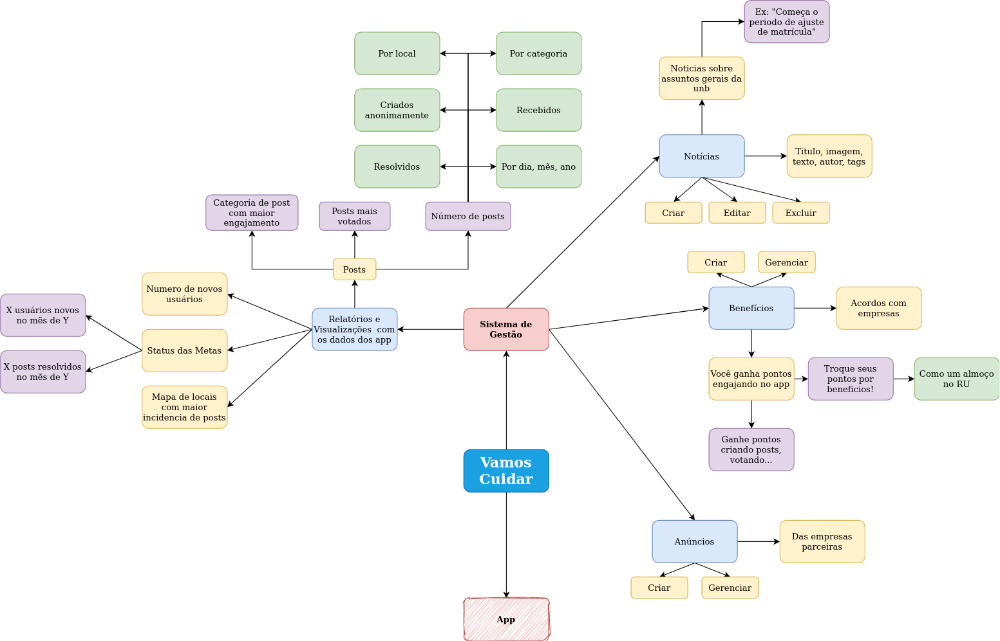

#	Engenharia de Requisitos

## Histórico de Revisão

|   Data   |  Versão  |        Descrição       |          Autor(es)          |
|:--------:|:--------:|:----------------------:|:---------------------------:|
|09/09/2020|   0.1    | Criação do Documento e Elicitação Adicionada        |   Guilherme  |
|10/09/2020|   0.2    | Adição do Backlog do Produto        |   Guilherme  |
|10/09/2020|   0.3    | Adição de uma nova história de usuário | Guilherme |
|15/09/2020|   1.0    | Criação do Backlog (versão completa) | Gabriel |
|25/09/2020|   1.1    | Adição de novos épicos | Gabriel |
|30/09/2020|   1.2    | Atualização do Backlog com os novos épicos | Gabriel |
|07/10/2020|   1.3    | Atualização dos Requisitos | Gabriel |

# Sumário
----------------
1. [Introdução](#1)
2. [Elicitação](#2)
    * 2.1 [Brainstorm](#2_1)
    * 2.2 [Introspecção](#2_2)
    * 2.3 [Requisitos](#2_3)
3. [Product Backlog](#3)
    * 3.1 [Épicos](#3_1)
    * 3.2 [Histórias de Usuário](#3_2)
    * 3.3 [Critérios de Aceitação](#3_3)

## 1. <a name="1"> Introdução</a>

A fase de levantamento de requisitos, em um projeto, representa a parte de negócio, ou seja, O QUE exatamente o cliente está precisando. Nessa fase, buscamos informações como: funcionalidades que o sistema deve ter, as regras de negócio dessas funcionalidades, restrições, usabilidade do software, e assim por diante. Neste documento vamos iniciar na fase de elicitação, modelagem e criação do backlog do produto.

## 2. <a name="2"> Elicitação</a>

 O termo elicitar significa definir, tornar explicito, obter o máximo de informação sobre o objeto em questão. Nessa atividade precisamos ser cuidadosos, tudo é orientado à satisfação do cliente, então temos que aprender a entender o cliente, seu conhecimento e suas reais necessidades. O tripé da elicitação é identificação de fontes de informação, coleta de fatos e comunicação.

As técnicas de elicitação empregadas pelo grupo foram brainstorming e instrospecção.

### 2.1 <a name="2_1">Brainstorm</a>

Brainstorming é a técnica de elicitação de novas e velhas ideias sobre determinado dominio para gerar soluções e ou levantar requisitos sobre o assunto. O tema do Brainstorming foi o de visão geral das funcionalidades do projeto

#### 2.1.1 Mapa Mental das funcionalidades do Vamos Cuidar

### 2.2 <a name="2_2">Introspecção</a>

A instrospecção é uma técnica muito rica e profunda. Consiste em entender quais propriedades o sistema deve possuir para que seja um sucesso. Demanda o Engenheiro de Requisitos imaginar o que ele gostaria, se ele tivesse que desempenhar uma dada tarefa, com os equipamentos disponiveis e demais recursos.

Decidimos fazer a instrospecção nos colocando no papel do funcionário do DAF que ficará responsável por analisar os relatórios do App do Vamos Cuidar e inserir noticias, gerencias anuncios e beneficios.

### 2.3. <a name="2_3"> Requisitos</a>

 Requisitos funcionais e não funcionais elicitados por meio das técnicas acima.

#### 2.3.1 Requisitos Funcionais
ID|Requisito
-|-
RF001| A aplicação deve permitir que o usuário efetue o login mediante suas credênciais.
RF002| A aplicação deve permitir que o usuário efetue o logout de sua conta.
RF003| A aplicação deve permitir que o usuário possa mudar sua senha.
RF004| A aplicação deve permitir que o usuário possa recuperar sua senha.
RF005| A aplicação deve permitir que permitir que o usuário navegue por meio do menu lateral.
RF006| A aplicação deve permitir que o usuário crie notícias.
RF007| A aplicação deve permitir que o usuário gerencie as notícias.
RF008| A aplicação deve permitir que o usuário crie benefícios.
RF009| A aplicação deve permitir que o usuário gerencie os benefícios.
RF010| A aplicação deve permitir que o usuário gerencie as postagens.
RF011| A aplicação deve permitir que o usuário envie dados de alta qualidade para o app do VCU.
RF012| A aplicação deve permitir que o usuário receba dados de alta qualidade para o app do VCU.
RF013| A aplicação deve permitir que o usuário visualize dados relacionados às postagens.
RF014| A aplicação deve permitir que o usuário visualize dados relacionados aos status das postagens.
RF015| A aplicação deve permitir que o usuário visualize gráficos relacionados às postagens.

 

#### 2.3.2 Requisitos Não Funcionais
ID|Requisito
-|-
RNF001| A aplicação deve armazenar com segurança os dados de login do usuário.
RNF002| A aplicação deve ter boa usabilidade e tempo rápido de resposta.

 

## 3. <a name="3"> Product Backlog</a>

### 3.1 <a name="3_1"> Épicos</a>

#### EP01: Perfis
Funcionalidades da aplicação ligadas á login & navegação.

#### EP02: Dados
Funcionalidades da aplicação ligadas ás visualizações de dados existente no projeto.

#### EP03: Notícias
Funcionalidades da aplicação ligadas ao gerenciamento de notícias e suas funcionalidades.

#### EP04: Benefícios
Funcionalidades da aplicação ligadas ao gerenciamento de benefícios e suas funcionalidades.

#### EP05: Postagens
Funcionalidades da aplicação ligadas ao gerenciamento de anúncios e suas funcionalidades.

#### EP06: Navegação
Funcionalidades da aplicação ligadas às funcionalidades que propiciam uma boa navegação no app.

#### EP07: Integração
Funcionalidades da aplicação ligadas à integração do VCU com o VCG.

### 3.2 <a name="3_2"> Histórias de Usuário</a>

<iframe src="https://docs.google.com/spreadsheets/d/e/2PACX-1vSIhwtJk-kRXEPWQFnGBw6V3KFDq9TuldGQ_liFcLGGcEK9KsnhaRRFCi_wKIeNCXkF27gg07pZiRql/pubhtml?gid=1655850659&single=true" width="150%" height="600px"></iframe>
Acesse aqui o documento: [Backlog](https://docs.google.com/spreadsheets/d/1ZnxAtnrdqo7PWjcRrh_JN4MN8xZvtoF3992LsYuRAws/edit?usp=sharing)

### 3.3 <a name="3_3"> Critérios de aceitação</a>

Definir especificidades, como qual tipo de gráfico utilizar.