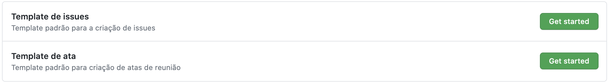
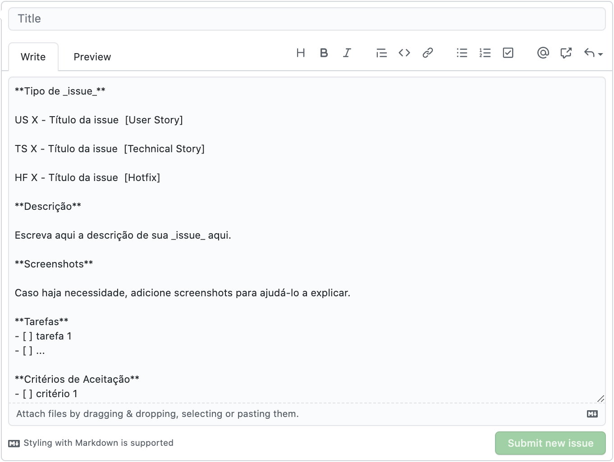
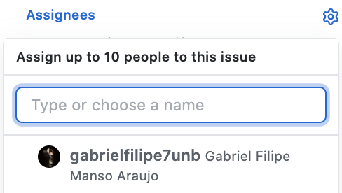
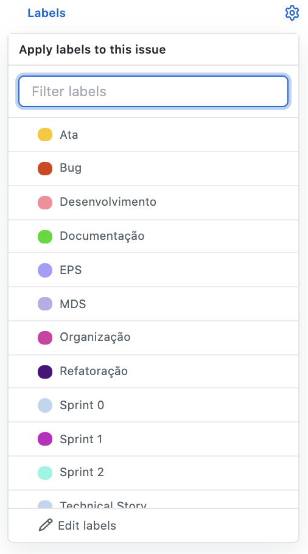
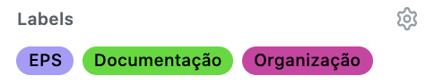
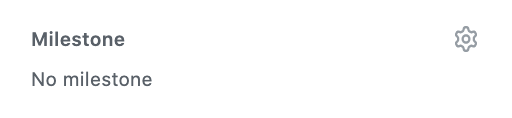

## Histórico de Revisão

| Data       | Versão | Descrição            | Autor             |
|:----------:|:------:|:--------------------:|:-----------------:|
| 02/00/2020 | 1.0 | Criação do documento de polílica de issues  | Gabriel Filipe |

# Criação de _issues_

&emsp;&emsp;As _issues_ devem seguir o seguinte padrão:

 1.  Escolha um padrão de _issue_ previamente criado.

 2.  O título será uma breve explicação do que será feito naquela _issue_.  

 3. Siga as instruções do template escolhido.  
 
 

 4.  Coloque a assinatura da pessoal responsável pelo trabalho da _issue_.  
 
 

 5. Adicione as _labels_ que representam o trabalho a ser realizado na _issues_.

 6. Adicione o _milestone_ a _issue_ pertence.

### Referências

* Lino. Disponível em <https://github.com/BotLino/Lino>