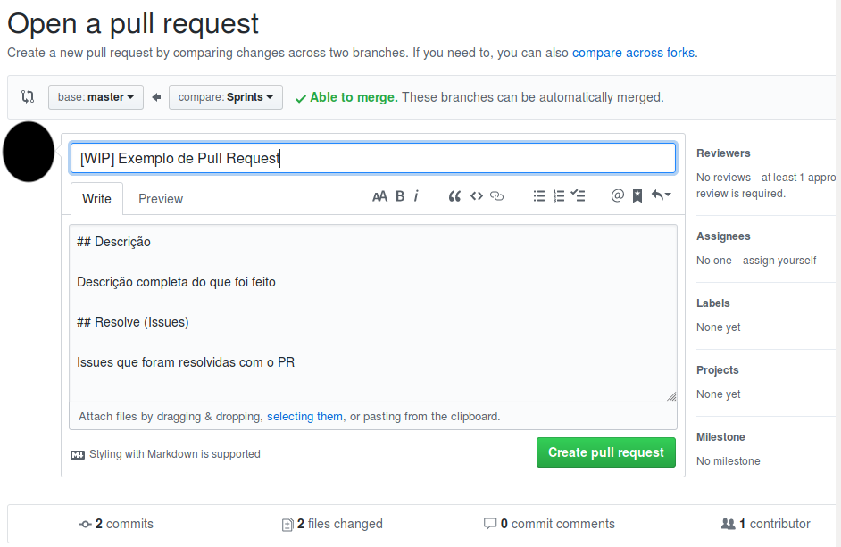
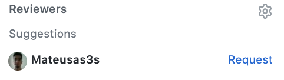
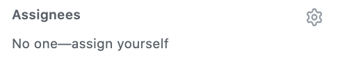
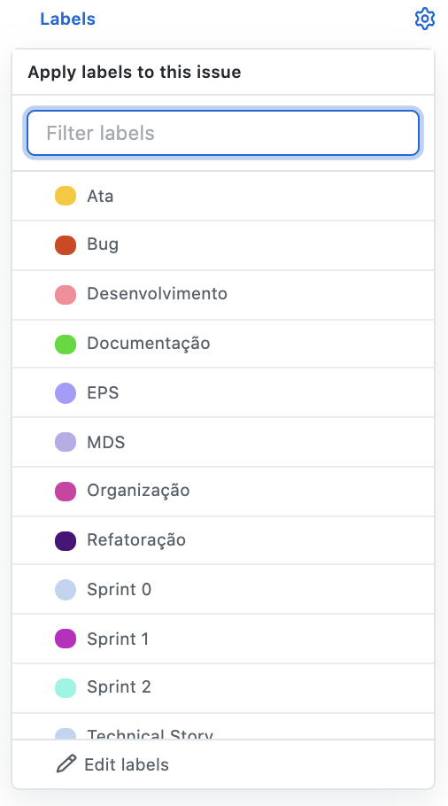
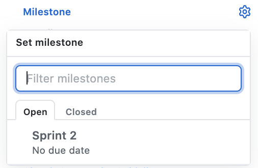

## Histórico de Revisão

|Data       | Versão | Descrição            | Autor             |
|:----------:|:------:|:--------------------:|:-----------------:|
| 02/09/2020 | 1.0 | Criação do documento de polílica de pull requests  | Gabriel Filipe |

# Criação de _Pull Request_

Considere uma situação hipotética onde estamos querendo criar um PR de uma _branch_ chamada **Sprints** para a _master_.

#### Nota:

- A criação do PR deve ser feita logo após o início do trabalho em uma issue. Para isso trabalhamos com a flag de _status_ **WIP**.

## Para a criação de um _pull request_ direcionado a branch _master_, deve-se seguir os seguintes passos:

### 1) Adicione a flag de _status_

* Titule o PR com a tag **WIP** (ou seja _work in progress_) 

### 2) Adicione uma descrição

* Utilize o _template_ de _issue_ destinada ao _pull request_.
* Lembrando que o _pull request_ tem a _branch_ base a **_master_** e a _compare_ a branch que se deseja juntar.
* **Lembrando**: assim que for realmente finalizado as alterações referentes ao _pull request_, deve-se retirar a tag **WIP**.

 
### 3) Adicione os _reviewers_ 

* Assinale os _reviewers_, ou seja, aqueles responsáveis à análise do _pull request_. Por exemplo, caso sua _feature_ esteja relacionada a arquitetura do projeto, assinale o **EPS** que desempenha esse papel.

### 4) Adicione os _assignees_

* Assinale os colaboradores do _pull request_

### 5) Adicione as devidas _labels_

* Marque as _labels_ relacionadas ao _pull request_. Geralmente será as mesmas assinaladas na issue referente.

### 6) Adicione a devida _milestone_

* Marque a _Milestone_, ou seja, a _sprint_ ou _release_ atual.

### 7) Explicite a _issue_ relacionada ao PR

* Conecte a _issue_ trabalhada neste _pull request_ por meio de _closing keywords_.

| Issue a ser _linkada_ | Sintaxe | Examplo |
|:----------:|:------:|:--------------------:|
|Issue dentro deste repositório|KEYWORD #ISSUE-NUMBER|**Closes #10**|
