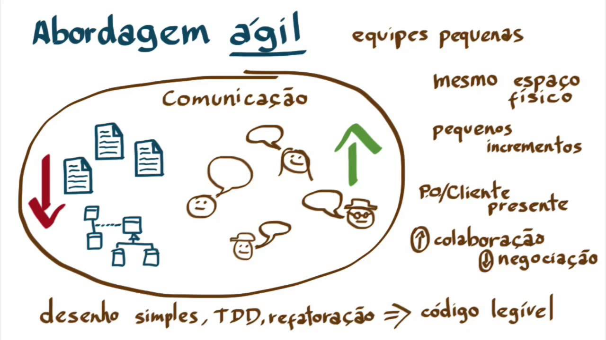
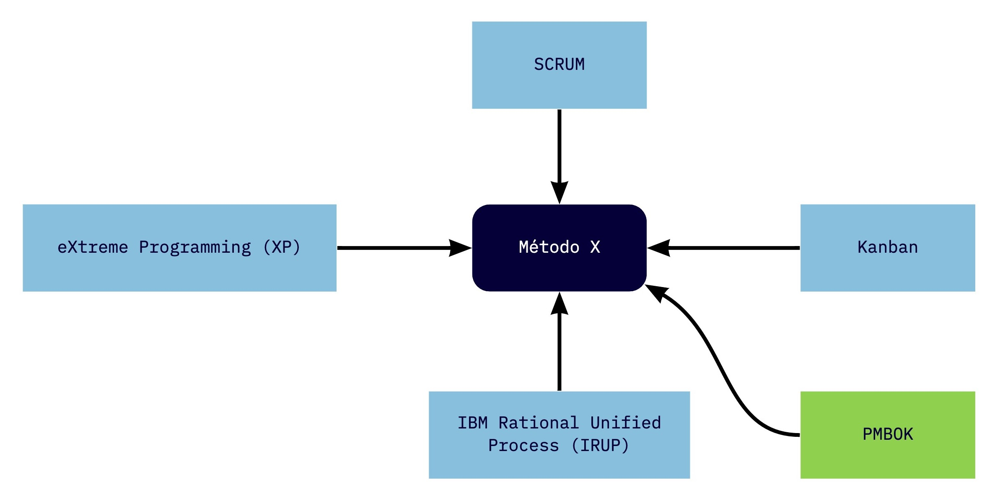
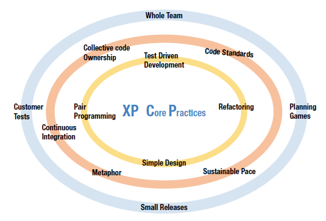
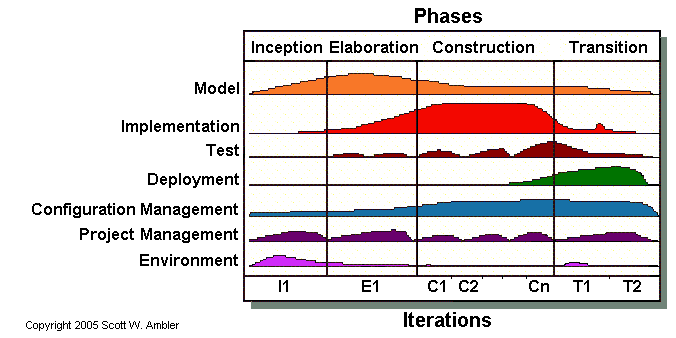
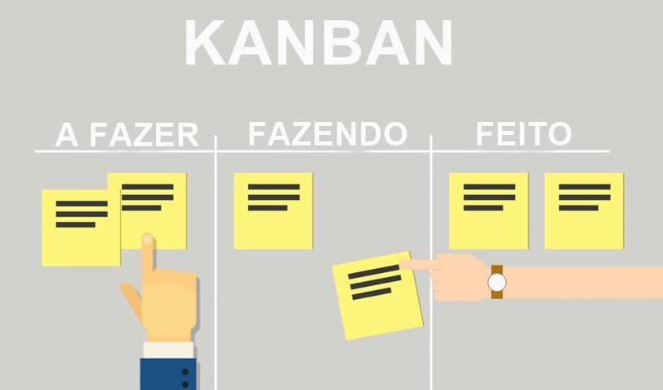
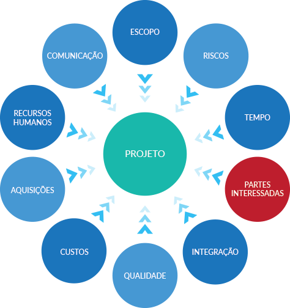

# Metodologia de Desenvolvimento de Software

## Histórico de Revisão

|   Data   |  Versão  |        Descrição       |          Autor(es)          |
|:--------:|:--------:|:----------------------:|:---------------------------:|
|11/09/2020|   0.1    | Criação do Documento        |   Mateus Sousa   |
|09/10/2020|   1.0    | Adiciona a metodologia   |   Gabriel Filipe   |
| 10/12/2020 |  2.0  | Criação do documento de metodologia  | Gabriel Filipe |

## 1) Introdução

As definições modernas de desenvolvimento de software ágil evoluíram a partir da metade de 1990 como parte de uma reação contra métodos tradicionais "pesados", caracterizados por uma regulamentação significante, regimentação e micro gerenciamento aplicada pelo modelo "cascata" de desenvolvimento. O processo originou-se da visão de que o modelo em cascata era muito burocrático, lento e contraditório a forma usual com que os engenheiros de software sempre realizaram trabalho com eficiência.

Em 2001, membros proeminentes da comunidade de software se reunem em Snowbird e publicam o "Manifesto ágil", documento que reúne os princípios e práticas dos métodos de desenvolvimento ágil. Logo em seguida, a Agile Alliance, uma organização não lucrativa que promove o desenvolvimento ágil é formada [1]. Ambos surgem com o intuito de "restaurar a credibilidade à palavra método" dentro do contexto de desenvolvimento de software [9].

## 2) Métodos ágeis

Os métodos ágeis são uma alternativa à gestão tradicional de projetos, eles nasceram nos braços do desenvolvimento de software, mas hoje podem ser aplicados a qualquer tipo de projeto (inclusive os que não se remetem ao desenvolvimento de software). Assim, os métodos ágeis vem ajudando muitas equipes a encarar a imprevisibilidades dentro de um projeto através de entregas incrementais e ciclos iterativos. Os métodos ágeis passaram a ser uma alternativa aos métodos conhecidos como cascata, tradicionais, pesados ou clássicos [2].

Basicamente, os métodos ágeis são um conjunto de práticas eficazes que se destinam a permitir a entrega rápida e de alta qualidade do produto, tendo uma abordagem de negócios que alinha o desenvolvimento do projeto com as necessidades do cliente e os objetivos da empresa, além de incentivar a inspeção e adaptação frequente e, o auto-gerenciamento e a comunicação frequente dos membros da equipe do projeto [2].

São consideradas métodos ou frameworks ágeis [3][4]:

- SCRUM;
- *Scaled Agile Framework* (SAFe);  
- *Feature Driven-Development* (FDD);  
- *Test Driven Development* (TDD);  
- *eXtreme Programming* (XP);  
- *IBM Rational Unified Process* (IRUP);  
- *Dynamic Systems Development Method* (DSDM);  
- *Microsoft Solutions Framework* (MSF);  
- *Adaptative Software Development (ASD)*;  
- Entre outros...  

## 3) Métodos ágeis adaptáveis

Pesquisas empíricas mostram que métodos tradicionais usados no desenvolvimento de software são bastante limitados e que, os desenvolvedores que fazem uso de tais métodos tendem a usar combinações de diferentes métodos e/ou partes específicas de um método, em vez de seguir todas as etapas exigidas por um método em particular [5][6]. Um outro estudo, descobriu que apenas 6% dos desenvolvedores seguem rigorosamente os métodos tradicionais [7]. Fowler afirma que a natureza burocrática de métodos tradicionais retarda o desenvolvimento de software a ponto de os desenvolvedores são forçados a abandoná-los [4][8].

Fazendo coro às afirmações acima e levando em consideração as necessidades do nosso projeto, foi-se necessário adaptar alguns métodos, escolhendo-se apenas algumas partes específicas de cada, a fim de se encontrar um "método X" no qual o nosso time atingisse uma eficiência e produtividade satisfatória. Dos métodos utilizados (e adaptados) foram : 

- SCRUM;  
- *eXtreme Programming* (XP);  
- *IBM Rational Unified Process* (IRUP);  
- Kanban;  

Cada um dos métodos acima será brevemente descrito abaixo e, em seguida, apontaremos o que for utilizado de cada um deles.

### 3.1) Scrum:

Criada pelos desenvolvedores Ken Schwaber e Jeff Sutherland, SCRUM é método de gerenciamento ágil. Ele tem como base as equipes pequenas e multidisciplinares, os feedbacks constantes e a colaboração direta dos envolvidos.

O SCRUM deve ser visto como uma forma de orientar o trabalho de equipes com foco em resultados inteligentes e alinhados com as demandas existentes. Ele coloca a equipe do projeto preparada para entregar novidades continuamente. Além disso, amplia o alinhamento de expectativas entre os participantes no projeto, evitando baixa insatisfação.

Em outras palavras, o método SCRUM atua no gerenciamento de projetos, auxiliando no alcance de todos esses objetivos definidos durante as etapas de planejamento. Com o maior alinhamento entre os times, torna-se mais fácil avaliar o que deve ser feito para evitar desperdícios e melhorar o resultado final. Ou seja, a metodologia SCRUM amplia a habilidade de profissionais de gestão para entregarem os resultados esperados pelo cliente.

Uma das características mais marcantes do SCRUM é que cada membro do projeto possuí um papel e responsabilidades bem definidas. Cada membro da equipe conhece sua função no time, facilitando muito o andamento dos projetos. Quando cada profissional sabe exatamente quais são suas tarefas e obrigações, **a equipe gerencia a si mesma naturalmente**, sem precisar de cobranças externas constantes [10].

Dentro de uma equipe de projeto que atua no ambiente SCRUM, há vários papéis que são formulados para orientar o fluxo de trabalho e garantir que cada um esteja pronto para atuar de modo autônomo.

#### 3.1.1) Eventos do método:

- *Sprints (com duração bem definida)*;  

- *Daily SCRUM*;  

- *Sprint Planning*;  

- *Sprint Review*;  

- *Sprint Retrospective*;  

- *Time-box meetings*;  

#### 3.1.2) Eventos do método utilizados no projeto:

- *Sprints* (de 1 semana);  

- *Daily SCRUM* **;  

- *Sprint Planning*;  

- *Sprint Retrospective*;  

**** No começo do desenvolvimento do projeto adotamos o uso das *dailies* rigorasamente. Todavia, com o decorrer do projeto, foi identificado que o time estava com bastante dificuldade de manter a sua prática e, por isso, um pouco antes da R2, passou a não ser mais realizada.

### 3.2) *eXtreme Programming* (XP):

Criada em 1997, o XP é um método de desenvolvimento de software, leve, não é prescritivo, e procura fundamentar as suas práticas por um conjunto de valores que serão vistos posteriormente no artigo. O XP, diferentemente do que muito pensam, também pode ser adotar por desenvolvedores médios e não apenas por desenvolvedores experientes [12].

O objetivo principal do XP é levar ao extremo um conjunto de práticas que são ditas como boas na engenharia de software e suas práticas são fundamentadas nos valores abaixo:

- Comunicação  
- Coragem  
- Feedback  
- Respeito  
- Simplicidade  

#### 3.2.1) Práticas do método:

O XP foi descrito como tendo 12 práticas, agrupadas em quatro áreas [11]:

***Fine-scale feedback***  
- *Pair programming*;  
- *Planning game*;  
- *Test-driven development*;  
- *Whole team*;  

***Continuous process***  
- *Continuous integration*;  
- *Refactoring or design improvement*;  
- *Small releases*;  

***Shared understanding***  
- *Coding standards*;  
- *Collective code ownership*;  
- *Simple design*;  
- *System metaphor*;  

***Programmer welfare***  
- *Sustainable pace*;  

#### 3.2.2) Práticas do método utilizados no projeto:

Das 12 práticas acima descritas, 7 foram utilizadas. São elas:

***Fine-scale feedback***  
- *Pair programming*;  
- *Planning game*;  
- *Whole team*;  

***Continuous process***  
- *Continuous integration*;  
- *Refactoring or design improvement*;  

***Shared understanding***
- *Coding standards*;  
- *Collective code ownership*;  

### 3.3) IBM Rational Unified Process (IRUP):

O RUP foi criado pela *Rational Software Corporation*, e adquirida pela IBM tempos depois, ganhando um novo nome IRUP (*IBM Rational Unified Process*). O IRUP fornece técnicas a serem seguidas pelos membros da equipe de desenvolvimento de software com o objetivo de aumentar a sua produtividade no processo de desenvolvimento.

O IRUP usa a abordagem da orientação a objetos em sua concepção e é projetado e documentado utilizando a notação UML (*Unified Modeling Language*) para ilustrar os processos em ação. Também, o IRUP se esforça em consolidar estruturas de código a fim de estimular a padronização dos procedimentos normalmente adotados.

É um processo considerado pesado e preferencialmente aplicável a grandes equipes de desenvolvimento e a grandes projetos, porém o fato de ser amplamente customizável torna possível que seja adaptado para projetos de qualquer escala. Para a gerência do projeto, o RUP provê uma solução disciplinada de como assinalar tarefas e responsabilidades dentro de uma organização de desenvolvimento de software [13].

#### 3.3.1) Práticas do método:

Dentre as principais práticas do RUP podemos citar:

- Gestão de Requisitos;  

- Uso de Arquitetura Baseada em Componentes;  

- Uso de Software de Modelos Visuais;  

- Verificação da Qualidade do Software;  

- Gestão e Controle de Mudanças do Software;  

#### 3.3.2) Práticas do método utilizados no projeto:

Em nosso projeto, todas as 5 acima foram utilizadas:

- Gestão de Requisitos;  

- Uso de Arquitetura Baseada em Componentes;  

- Uso de Software de Modelos Visuais **;  

- Verificação da Qualidade do Software;  

- Gestão e Controle de Mudanças do Software;  

**** Sobre o uso de modelos visuais de software, vale ressaltar que a carga completa proporcionada pelo UML (*Unified Modeling Language*) é bastante alta e, por isso, foram escolhidas apenas as representações que o time do projeto identificou como mais didáticas.

### 3.4) Kanban:

O Kanban pode ser utilizado sozinho, sem a necessidade de outros frameworks ou métodos. David J. Anderson descreve o Kanban como um caminho alternativo para a agilidade. Porém, o método também pode ser usado para apoiar outros métodos.

A perspectiva baseada em fluxo do Kanban pode melhorar e complementar o framework *Scrum* e sua implementação. Times, por exemplo, podem aplicar o Kanban tanto se estiverem começando a usar o *Scrum* quanto se já o utilizam há muito tempo.

Utilizando o Kanban para visualizar o trabalho de novas formas, um "*Time Scrum*" pode aplicar o conjunto de práticas do Kanban para otimizar o valor da entrega de maneira mais efetiva. Essas práticas se apoiam e expandem os princípios do pensamento Lean, fluxo de desenvolvimento de produtos e teoria das filas abaixo descritas [14].

#### 3.4.1) Práticas do método:

- Visualização do Fluxo de Trabalho;  

- Limitando o Trabalho em Progresso (WIP);  

- Gerenciamento ativo dos itens de trabalho em andamento;  

- Inspecionando e adaptando sua definição de “Fluxo de Trabalho”;  

#### 3.4.2) Práticas do método utilizados no projeto:

Das práticas citadas acima, todas foram seguidas pelo time rigorosamente.

## 4) PMBOK

Além da adaptação dos métodos ágeis descrita acima, o grupo também usufruiu do guia PMBOK para o monitoramento do time e gestão do projeto em si. O PMBOK é uma espécie de enciclopédia sobre gerenciamento de projetos publicada. Sua publicação é regularmente revisada pelo PMI (*Project Management Institute*). Sua função é padronizar e difundir as práticas mais eficientes, testadas e comprovadas por gerentes de projetos do mundo inteiro em um só guia.

O PMBOK também fornece e promove um vocabulário comum para se discutir, escrever e aplicar o gerenciamento de projetos possibilitando o intercâmbio eficiente de informações entre os profissionais de gerência de projetos.

Em sua sexta edição (2017), o PMBOK reconhece 49 processos que recaem em 5 grupos de processos e 10 áreas de conhecimento que são típicas em quase todas áreas de projetos [15].

#### 4.1) Processos de gerenciamento utilizados:

Dentre os 49 processos reconhecidos pela sexta edição do guia PMBOK, o time se preocupou em utilizar somente os que foram identificado como cabíveis ao projeto e, alguns deles, são mostrados nos tópicos abaixo:

- Desenvolver o termo de abertura do projeto;  
- Desenvolver o plano de gerenciamento do projeto;  
- Orientar e gerenciar o trabalho do projeto;  
- Monitorar e controlar o trabalho do projeto;  
- Realizar o controle integrado de mudanças;  
- Encerrar o projeto;  
- Coletar os requisitos;  
- Criar a EAP;  
- Validar o escopo;  
- Controlar o escopo;  
- Planejar o gerenciamento do Cronograma;  
- Definir as atividades;  
- Sequenciar atividades;  
- Estimar os recursos das atividades;  
- Estimar as durações das atividades;  
- Desenvolver o cronograma;  
- Controlar o cronograma;  
- Planejar o gerenciamento da qualidade;  
- Controlar a qualidade;  
- Mobilizar a equipe do projeto;  
- Desenvolver a equipe do projeto;  
- Gerenciar a equipe do projeto;  
- Planejar o gerenciamento das comunicações;  
- Gerenciar as comunicações;  
- Planejar o gerenciamento dos riscos;  
- Identificar os riscos;  
- Realizar a análise quantitativa dos riscos;  
- Planejar as respostas aos riscos;  
- Controlar os riscos;  
- Identificar partes interessadas;  
- Gerenciar o envolvimento das partes interessadas;  
- Controlar o envolvimento das partes interessadas;  

## 5) Análises de Desempenho do Time

Para mensurar o desempenho, produtividade e a evolução da equipe dentro do projeto foram utilizados alguns artefatos. Foram eles:

 - *Burndown*:   
   Tem como objetivo monitorar as atividades (*issues*) do projeto.    

- *Burndown* de Riscos:   
  Tem como objetivo monitorar os riscos do projeto, a fim de evitar complicações e maiores problemas ao longo das *sprints*.    

- *Velocity*:   
  Tem como objetivo verificar a média de pontos que o grupo consegue entregar por sprint. Atuará como ferramenta para análise da capacidade de desenvolvimento da equipe. Ele será elaborado ao fim de cada sprint e é consultado no planejamento da sprint seguinte.    

- Gráfico de Contribuições por Repositório:   
  Tem como objetivo verificar a constância das contribuições. Este gráfico é proporcionado pelo GitHub.    

- Quadro de Conhecimentos:   
  Tem como objetivo monitorar a evolução do conhecimento dos membros da equipe nas perante a exposição dos mesmos à tecnologias novas.    

- Planilha de Horas:   
  Tem como objetivo monitorar a carga de trabalho de cada membro.    

Através da análise desses pontos acima o time consegue planejar as próximas atividades, identificar problemas e gargalos durante o processo de desenvolvimento de software, e propor intervenções quando cabíveis.    

## 7) Referências

[1] [Desenvolvimento Ágil de Software](https://pt.wikipedia.org/wiki/Desenvolvimento_%C3%A1gil_de_software)  
[2] [O que são métodos ágeis](https://www.culturaagil.com.br/o-que-sao-metodos-ageis/#)  
[3] [Métodologias ágeis](https://www.euax.com.br/2019/04/metodologias-ageis/)  
[4] Brian Fitzgerald, Gerard Hartnett & Kieran Conboy (2006) Customising agile methods to software practices at Intel Shannon, European Journal of Information Systems, 15:2, 200-213, DOI: 10.1057/palgrave.ejis.3000605   
[5] FITZGERALD B (1996) Formalised systems development methodologies: a critical perspective. Information Systems Journal 6, 3–23.   
[6] HIDDING G (1996) Method engineering: experiences in practice. In Method Engineering: Principles of Method Construction and Tool Support (BRINKKEMPER SKL and WELKE R, Eds), Kluwer, London.  
[7] FITZGERALD B (2000) Systems development methodologies: the problem
of tenses. Information Technology and People 13, 13–22.  
[8] FOWLER M (2000) Put your process on a diet. Software Development 8(12),
32–36.  
[9] FOWLER M and HIGHSMITH J (2001) The agile manifesto. Software Development, August.  
[10] [O que é SCRUM](https://www.projectbuilder.com.br/blog/o-que-e-scrum/)  
[11] [Extreme Programming Practices](https://en.wikipedia.org/wiki/Extreme_programming_practices)  
[12] [Introdução ao Extreme Programming (XP)](https://www.devmedia.com.br/introducao-ao-extreme-programming-xp/29249)  
[13] [IBM Rational Unified Process](https://pt.wikipedia.org/wiki/IBM_Rational_Unified_Process)  
[14] [Kanban](https://pt.wikipedia.org/wiki/Kanban)  
[15] [Project Menagement Body of Knowledge](https://pt.wikipedia.org/wiki/Project_Management_Body_of_Knowledge)